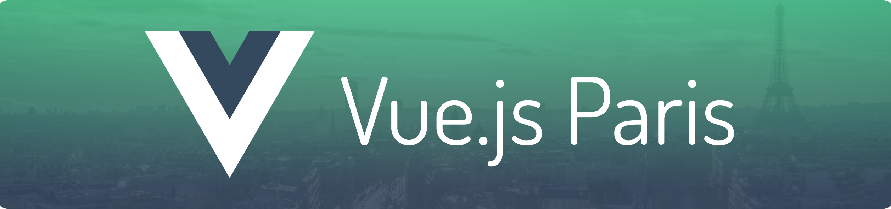

<h1><a href="https://github.com/Vue-js-Paris/talks/issues/new?assignees=&labels=&projects=&template=new_talk_fr.yml">Proposer un talk (FR) →</a></h1>
<h1><a href="https://github.com/Vue-js-Paris/talks/issues/new?assignees=&labels=&projects=&template=new_talk_en.yml">CFP (EN) →</a></h1>

<h2><a href="https://github.com/orgs/Vue-Js-Paris/projects/1/views/1">Voir le planning →</a></h2>

### Todos

- Migrate talks from Trello
- Apply time labels to templates
- Apply language labels to the templates
